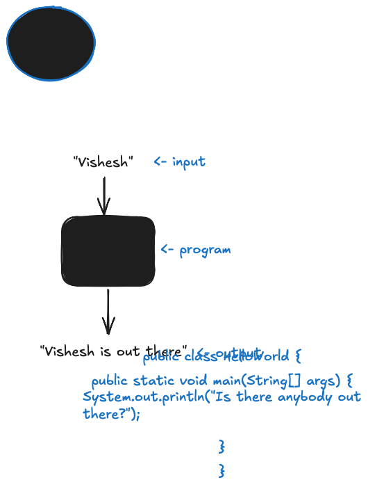

# [CS143](../index.md): Elements of Programming

## Your First Program


1. Write the simplest Java program and save it in the file HelloWorld.java. For example:

    [HelloWorld.java](/code/HelloWorld.java)

2. Compile HelloWorld.java:

    ```bash
    $ javac HelloWorld.java
    ```

    (Can encounter _compile-time_ errors)

3. Run HelloWorld:

    ```bash
    $ java HelloWorld
    ```

    (Can encounter _run-time_ errors)

<details>
<summary>Exercises</summary>

1. Write a program that prints the message `Hello World` 10 times.

</details>

## Command-line Args

Model: program as a black box that maps input to output:



Command line args: one way to provide input.

1. [UseArg.java](/code/UseArg.java)
2. `$ javac UseArg.java`
3. `$ java UseArg Vishesh`

<details>
<summary>Exercises</summary>

1. Write a program UseThree.java that takes three names as command-line arguments and prints a proper sentence with the names in the reverse of the order given, so that, for example, `java UseThree Alice Bob Carol` prints `Hi Carol, Bob, and Alice`. 

</details>

## Built-in Data Types

> A **data type** is a _set of values_ and a _set of operations_ defined on those values.

For example, real numbers in mathematics:
- values: points on the number line (infinite)
- operations: add, subtract, multiply, divide

> A **built-in** data type is built into the Java language.

The nine built-in data types in Java:

| type | set of values | common operators | sample values |
| --- | --- | --- | --- |
| _byte_ | 8-bit signed integers | + - * / % | -128, 127, 0, -6, 6 | 
| _short_ | 16-bit signed integers | + - * / % | - $2^{15}$, $(2^{15} - 1)$, 0, -6, 6 |
| _int_ | 32-bit signed integers | + - * / % | - $2^{31}$, $(2^{31} - 1)$, 0, -6, 6 |
| _long_ | 64-bit signed integers | + - * / % | - $2^{63}$, $(2^{63} - 1)$, 0, -6, 6 |
| _float_ | single-precision floating point (6 to 7 decimal digits) | + - * / | 3.14, 2.5, 6.022e23 |
| _double_ | double-precision floating point (15 to 16 decimal digits) | + - * / | 3.14, 2.5, 6.022e23 |
| _boolean_ | true or false | && || ! | true, false |
| _char_ | characters |  | 'A', 'a', '&', '\n' |
| _String_ | sequences of characters | + | "AB", "Hello", "2.5" |

_String_ is the only built-in data type that is not a primitive data type (note the capital 'S').

> A **primitive** data type is such that a variable of that type stores the data type value itself (as opposed to a reference/pointer).

Some terminology around data types:

| Term | Meaning | Examples |
| --- | --- | --- |
| Literal | Code representation of a data type value | _42_ (for int), _true_ (for boolean) |
| Operator | Code representation of a data type operation | _+_ (addition of number types), _&&_ (boolean and) |
| Identifier | Code representation of a name (e.g. for a variable) | _abc_, _Ab$_, _x1_ |
| Variable | An identifier that holds a data type value that may change | _abc_ of type int can store any int value |
| Declaration | Statement that creates a variable | `double total;` | 