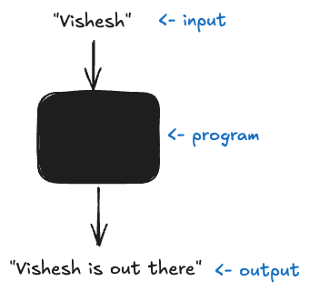

# [CS143](../index.md): Elements of Programming

- [CS143: Elements of Programming](#cs143-elements-of-programming)
  - [Your First Program](#your-first-program)
  - [Command-line Args](#command-line-args)
  - [Built-in Data Types](#built-in-data-types)
    - [Terminology](#terminology)
    - [Tracing](#tracing)
  - [Control Flow](#control-flow)
    - [Conditionals](#conditionals)
    - [While loops](#while-loops)
    - [For loops](#for-loops)
    - [Nested loops](#nested-loops)


## Your First Program


1. Write the simplest Java program and save it in the file HelloWorld.java. For example:

    [HelloWorld.java](/code/HelloWorld.java)

2. Compile HelloWorld.java:

    ```bash
    $ javac HelloWorld.java
    ```

    (Can encounter _compile-time_ errors)

3. Run HelloWorld:

    ```bash
    $ java HelloWorld
    ```

    (Can encounter _run-time_ errors)

<details>
<summary>Exercises</summary>

1. Write a program that prints the message `Hello World` 10 times.

</details>

## Command-line Args

Model: program as a black box that maps input to output:



Command line args: one way to provide input.

1. [UseArg.java](/code/UseArg.java)
2. `$ javac UseArg.java`
3. `$ java UseArg Vishesh`

<details>
<summary>Exercises</summary>

1. Write a program UseThree.java that takes three names as command-line arguments and prints a proper sentence with the names in the reverse of the order given, so that, for example, `java UseThree Alice Bob Carol` prints `Hi Carol, Bob, and Alice`. 

</details>

## Built-in Data Types

> A **data type** is a _set of values_ and a _set of operations_ defined on those values.

For example, real numbers in mathematics:
- values: points on the number line (infinite)
- operations: add, subtract, multiply, divide

> A **built-in** data type is built into the Java language.

The nine built-in data types in Java:

| type | set of values | common operators | sample values |
| --- | --- | --- | --- |
| _byte_ | 8-bit signed integers | + - * / % | -128, 127, 0, -6, 6 | 
| _short_ | 16-bit signed integers | + - * / % | - $2^{15}$, $(2^{15} - 1)$, 0, -6, 6 |
| _int_ | 32-bit signed integers | + - * / % | - $2^{31}$, $(2^{31} - 1)$, 0, -6, 6 |
| _long_ | 64-bit signed integers | + - * / % | - $2^{63}$, $(2^{63} - 1)$, 0, -6, 6 |
| _float_ | single-precision floating point (6 to 7 decimal digits) | + - * / | 3.14, 2.5, 6.022e23 |
| _double_ | double-precision floating point (15 to 16 decimal digits) | + - * / | 3.14, 2.5, 6.022e23 |
| _boolean_ | true or false | && \|\| ! | true, false |
| _char_ | characters (16 bits Unicode) |  | 'A', 'a', '&', '\n' |
| _String_ | sequences of characters | + (concatenate) | "AB", "Hello", "2.5" |

_String_ is the only built-in data type that is not a primitive data type (note the capital 'S').

> A **primitive** data type is such that a variable of that type stores the data type value itself (as opposed to a reference/pointer).

### Terminology 

```java
int a;
```

**Declaration** of the **variable** named _a_ which holds an _int_ data-type value. The value may change as the program proceeds.

---

```java
int a;
a = 1234;
```

**Literal** _1234_ is the Java-code representation of an _int_ data-type value. 

**Assignment** of the _int_ data-type value _1234_ to the variable named _a_.

---

```java
int a;
a = 1234;
int c = a + 99;
```

**Operator** '$+$' is the Java-code respresentation of an _int_ data-type operation. 

**Expression** $a+b$ is a combination of literals, variables, and operators that Java evaluates to produce a data-type value.

**Type safety**: an expression in Java can only contain values and operations of the same data-type.

Variable _c_ is **inline initialized** by combining its declaration with its assignment.

### Tracing

```java
int a = 1234;
int b = 99;
int t = a;
a = b;
b = t;
```

What does the above program do?

**Trace** or **dry-run** of the program:
| | a | b | t |
| --- | --- | --- | --- |
| `int a = 1234;` | **1234** | undefined | undefined |
| `int b = 99;` | 1234 | **99** | undefined |
| `int t = a;` | 1234 | 99 | **1234** |
| `a = b;` | **99** | 99 | 1234 |
| `b = t;` | 99 | **1234** | 1234 |

<details>

<summary>Exercises</summary>

1. Write a program that outputs the values of $x$ that satisfy the quadratic equation $a x^2 + b x + c = 0$. The program should take as  input three command-line arguments denoting $a, b, c$. The program can use the quadratic formula $x = \frac{-b \pm \sqrt{b^2 - 4 a c}}{2 a}$.

2. Write a program that outputs whether  an integer corresponds to a leap year. A non-century year is a leap year if it is divisible by 4. A century year is a leap year if it is divisible by 400.

1. Write a program that calculates and prints the amount of money you would have after $t$ years if you invested $P$ dollars at an annual interest rate $r$ (compounded continuously). You can use the formula $P e^{r t}$.

1. Write a program that outputs the effective temperature (wind chill) $w$, given the actual temperature $T$ (in degrees Farenheit) and the wind speed $v$ (in miles per hour). You can use the formula $w = 35.74 + 0.6215 T + (0.4275 T - 35.75) v^{0.16}$ for reasonable values of $T$ ($< 50$) and $v$ ($3 < v < 120$).

</details>

## Control Flow

**Control flow** = sequencing of statements

**Conditionals** and **loops** change the control flow.

### Conditionals

Example (max of two):

```java
if (x > y) {
    max = x;
} else {
    max = y;
}
```

Flowchart visualization:


### While loops

```java
int i = 0;
while (i < 10) {
    System.out.println(i + "th Hello");
    i = i + 1;
}
```

Flowchart: 


> Few lines of code results in potentially unlimited number of statements executed => Solve problems that are intrtactable without computers.

Trace:

| i | i < 10 |
| --- | --- |
| 0 | true |
| 1 | true |
| 2 | true |
| 3 | true |
| 4 | true |
| 5 | true |
| 6 | true |
| 7 | true |
| 8 | true |
| 9 | true |
| 10 | **false** |

### For loops

```java
for (int i = 0; i < 10; i++) {
    System.out.println(i + "th Hello");
}
```

Similar to _while loops_ but more compact and redable.

```java
for (<initial-value>; <continuation-condition>; <next value>) {
    <body>;
}
```

```java
<initial-value>;
while (<continuation-condition>) {
    <body>;
    <next value>;
}
```

**Compound assignment**:

```java
i = i + 1;
i += 1;
i++; // post-increment i.e. x = i++ increments after x is assigned
++i; // pre-increment i.e. x = ++i increments before x is assigned
```

**Scope**:

- The scope of a variable is the part of the program that can use that variable
- Typical scope = same block of statements as the declaration
- _for_ loop header and body considered to be same block
  - loop variable not available outside the loop

---

<details>

<summary>Exercises</summary>

1. Compute the finite sum $1 + 2 + ... + n$
2. Compute the largest power of 2 less than or equal to $n$
3. Compute amount of money you would have after $t$ years if you invested $P$ dollars at an annual interest rate $r$ (compounded annually). 

</details>

---

### Nested loops

```java
for (int i = 1; i < 11; i++) {
    for (int j = 1; j < 11; j++) {
        int product = i * j;
        System.out.println(i + " * " + j + " = " + product);
    }
}
```

What does the above program do?